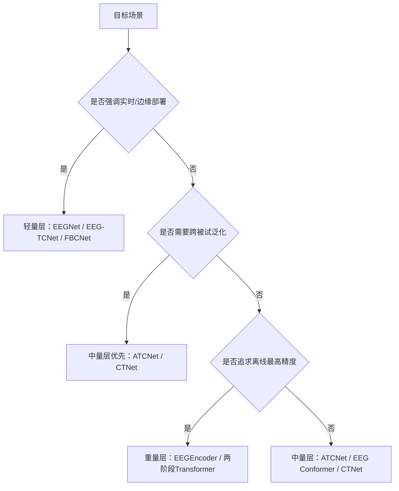

# 在 BCIC IV 2a 上实现高性能脑电运动想象解码的模型架构与方法报告

## 执行摘要

BCIC IV 2a 仍然是四分类运动想象 EEG 解码最常用、也最容易“看起来很强但并不完全可比”的公开基准之一。它包含 9 名被试、2 个会话、每会话 288 次试验、22 个 EEG 通道与 3 个 EOG 通道、采样率 250 Hz；很多论文实际只使用 EEG，并采用“会话一训练、会话二测试”的官方跨会话划分，或只在会话一上做 10 折交叉验证，少数工作再做 LOSO 跨被试评估。正因为协议不同，文中出现的 75%、82%、85% 乃至 88% 结果，往往不是同一难度下的 apples-to-apples 对比。citeturn16view0turn17view0turn11view0turn45view0turn33view0

从文献脉络看，BCIC2A 上的高性能方法已经从“频带分解 + 空间滤波”的传统路线，过渡到“浅层卷积前端 + 注意力/Transformer + TCN 或轻量分类头”的混合路线。真正普遍有效的共性，不是盲目加深网络，而是四件事：一是把时频或频带归纳偏置显式塞进模型，例如 FBCSP/FBCNet 的滤波器组、EEGNet/ATCNet/CTNet 的 EEG 专用卷积；二是把空间建模和时间建模拆开做，再融合；三是通过注意力或 Transformer 捕获较长程依赖；四是用适度的数据增强、归一化、早停和较严格的验证划分抑制过拟合。citeturn12view0turn19view0turn11view0turn9view0turn33view0turn44view0

如果按**模型复杂度与参数量**划分，本报告建议用一个面向 BCIC2A 实践的三层框架：**轻量层**定义为可训练参数不超过约 \(10^5\)，主要用于嵌入式、在线系统和快速实验；**中量层**定义为约 \(10^5\) 到 \(10^6\)，是当前 BCIC2A 最主流、综合性价比最高的区间；**重量层**定义为超过约 \(10^6\)，通常是多分支 Transformer/TCN 混合架构，离线高精度潜力更大，但训练成本、复现风险和协议不一致问题也更高。这个分层不是社区硬标准，而是结合 BCIC2A 常见模型公开参数、官方代码默认配置与可部署性做的分析性分层。citeturn11view0turn10view0turn10view2turn38view0turn39view0turn44view0

在高置信度结论上，**轻量层**里最值得长期使用的不是最老的 EEGNet，而是**FBCNet**与**EEG-TCNet/TCNet-Fusion**这类把频带或 TCN 偏置融入紧凑网络的模型；**中量层**里，**ATCNet**是近年来 BCIC2A 上最有代表性的“强而不算大”的方案，**CTNet**和**EEG Conformer**则代表了卷积-Transformer 混合范式的两个典型方向；**重量层**里，**EEGEncoder**与**两阶段 Transformer 网络**展示了更高的主观精度上限，但要特别警惕协议差异和复现实证还不够充分的问题。就“主流高性能路线”而言，今天 BCIC2A 上最流行的不是纯 Transformer，而是**CNN front-end + attention/Transformer + TCN/MLP head** 的混合范式。citeturn28view0turn11view0turn9view0turn33view0turn45view0turn29search3

## 数据集与比较口径

BCIC IV 2a 是四分类运动想象数据集，类别为左手、右手、双脚和舌头；每名被试有两个会话，官方常用做法是使用一个会话训练、另一个会话测试。FBCNet 论文对该数据集做了较清晰的 protocol 拆分：一类是只用 session 1 的 10 折交叉验证；另一类是 subject-specific 的 hold-out，也就是 **session 1 训练、session 2 测试**。ATCNet 代码仓库则明确区分了 **subject-dependent** 与 **LOSO subject-independent** 两种评测。CTNet 进一步提供了 subject-specific 与 LOSO 跨被试两类结果。也就是说，BCIC2A 研究至少存在三套常见口径：**会话内交叉验证、跨会话同被试测试、跨被试 LOSO**。这三者难度递增，结果不可直接混排。citeturn16view0turn17view0turn11view0turn33view0

在预处理上，BCIC2A 官方采集链路已带 0.5–100 Hz 带通和 50 Hz 陷波，但研究者通常还会再做二次处理。传统/滤波器组方法更依赖显式频带分解；FBCNet 直接把“多窄带滤波 + 空间卷积 + 方差汇聚”做进模型；Köllőd 等人的比较研究使用 1–45 Hz Butterworth 滤波和 FASTER 伪迹清理；而 ATCNet 的作者则强调其模型可直接从原始 EEG 学习，有意减少手工预处理。对 BCIC2A 这种小样本、多被试差异数据集，**预处理是否复杂**并没有单调地决定结果，真正决定性能的是“预处理与模型归纳偏置是否匹配”。citeturn12view0turn16view0turn25view0turn28view0turn11view0

参数量方面，很多论文并不直接报告。本报告采用三种口径：如果代码仓库已给出，则直接采用；如果官方实现公开，则按默认结构估算；如果只有论文摘要或 HTML 全文而没有完整实现，则给出**保守区间**并明确说明是假设。以公开代码可直接估算的模型为例，EEG Conformer 官方实现使用 `emb_size=40, depth=6`，并带一个较大的全连接头，按代码静态估算约 **78.98 万**参数；Braindecode 对 CTNet 的实现默认 `embed_dim=40, num_heads=4, num_layers=6`，对 1000 采样点窗口静态估算约 **15.27 万**参数。与之对照，ATCNet 官方复现仓库给出的参数量约 **11.37 万**，EEGNet 约 **2548**，ShallowConvNet 约 **4.74 万**。citeturn10view0turn10view2turn10view3turn38view0turn39view0turn11view0

为了帮助实际实施，下面给出一个可嵌入的选择流程示意。它不是论文原图，而是对当前 BCIC2A 常见路线的工程抽象。其判断逻辑由后续各层级分析支撑。citeturn11view0turn17view0turn33view0turn45view0

如果你后续要把本报告做成图示页，最推荐的三个图表类型是：**参数量-准确率散点图**、**按评测协议分组的箱线图**、**模型时间线**。前者最适合看“精度/复杂度”权衡，后两者最适合防止跨协议误读。citeturn11view0turn17view0turn33view0turn45view0

## 轻量层方法

### 层级定义

本报告把轻量层定义为：**传统方法或可训练参数不超过约 \(10^5\)** 的模型。这里的关键不是绝对数字，而是它们通常能在单卡、甚至边缘端完成训练/推理，且对样本量更友好。传统方法如 FBCSP 严格说并不存在可与深度网络等价的“参数量”，如果只把最终线性分类器和少量可训练部分算进去，通常也在很低量级，因此将其与超轻量 CNN 放在同一层讨论。citeturn17view0turn11view0

### 同层级模型比较

| 模型 | 年份 | 参数量 | 主要模块 | BCIC2A 性能 | 代码链接 |
|---|---:|---:|---|---|---|
| FBCSP-SVM | 经典基线 | 传统方法，参数量不适用 | 滤波器组 + CSP + SVM | 75.89%（10 折，仅 session 1）；68.06%（hold-out，session1→2）citeturn17view0 | 以 FBCNet/复现实验为主citeturn13view0 |
| EEGNet | 2018 | 2,548citeturn11view0 | depthwise + separable conv，EEG 专用紧凑 CNNciteturn19view0 | 73.15%（hold-out）citeturn17view0；68.67%（更严格 Train-Val-Test 复现）citeturn11view0 | 仓库内复现/原始实现入口citeturn11view0 |
| EEG-TCNet | 2020 | 4,096citeturn11view0 | EEGNet 前端 + TCNciteturn37search21 | 77.35%（文献综述中引用的 BCIC2A 结果）citeturn32view0；65.36%（Train-Val-Test 复现）citeturn11view0 | ATCNet 仓库内复现citeturn11view0 |
| MBEEG-SENet | 2022 | 10,170citeturn11view0 | 多分支 CNN + SE 注意力 | 69.21%（Train-Val-Test 复现）citeturn11view0 | ATCNet 仓库内复现citeturn11view0 |
| TCNet-Fusion | 2021 | 17,248citeturn11view0 | TCN 融合式时序建模 | 74.65% 平均准确率（按 9 被试、session split、5 个随机种子可由表 2 求均值）citeturn45view1turn45view3 | 作者实现由 EEGEncoder 论文沿用citeturn45view0 |
| FBCNet | 2021 | 约 \(1\times10^4\)–\(3\times10^4\) 粗估 | 多窄带表示 + 深度空间卷积 + Variance 层 + FCciteturn12view0turn13view0turn18view0 | 79.03%（10 折，仅 session 1）；76.20%（hold-out，session1→2）citeturn17view0 | 作者 GitHub 仓库citeturn13view0 |
| ShallowConvNet | 2017 | 47,364citeturn11view0 | 频带功率风格浅层卷积网络citeturn20view0 | 74.9%（merged subject data, within-subject, 5-fold，带 1–45Hz + FASTER）citeturn27view2turn26view1；67.48%（Train-Val-Test 复现）citeturn11view0 | Braindecode/复现仓库路线citeturn20view0turn11view0 |

### 这一层最值得关注的技术点

轻量层并不等于“过时”。相反，BCIC2A 上很多有效方法都在尽量把**生理先验变成小参数网络的归纳偏置**。FBCSP/FBCNet 的核心是把 μ/β 节律相关信息显式分带，再做空间滤波；EEGNet 用 depthwise/separable convolution，把“时域滤波 + 通道空间滤波”压到极小的参数预算中；EEG-TCNet/TCNet-Fusion 则在不显著增大参数量的前提下，补上了时间卷积对长序列建模的能力。这里的经验是：**BCIC2A 不是 ImageNet，小模型只要偏置设计得对，完全可能优于盲目加深的大模型。**citeturn12view0turn19view0turn37search21turn11view0

从性能上看，轻量层真正稳定的高点不是最小的 EEGNet，而是 **FBCNet** 与 **TCN 家族**。FBCNet 在作者论文里同时在 10 折和跨会话 hold-out 上均优于 FBCSP-SVM、DeepConvNet 和 EEGNet，尤其说明“滤波器组 + 方差聚合”对 BCIC2A 这种小样本四分类任务很合适。TCN 家族则表明，只要序列建模足够高效，轻量模型也能突破传统 compact CNN 的上限。citeturn17view0turn32view0turn45view1

### 复杂度与性能权衡

如果你关心训练时间，ATCNet 仓库在统一条件下给出了一组很有价值的参考：EEGNet 约 6.3 分钟、EEG-TCNet 约 7.0 分钟、ShallowConvNet 约 8.2 分钟、TCNet_Fusion 约 8.8 分钟，而 ATCNet 自身约 13.5 分钟，说明轻量层模型在单张 GTX 1080 Ti 上都非常容易迭代。它们的推理延迟通常也更适合在线 BCI。可解释性方面，FBCSP/FBCNet 最强，因为频带和空间模式有直接脑电学解释；ShallowConvNet 次之；EEGNet/EEG-TCNet 虽然可用 CAM 或 filter 可视化，但解释粒度略弱。复现性方面，FBCNet 和 EEGNet 家族最好，因为代码、默认配置和社区实现都较丰富。citeturn11view0turn16view0turn13view0

### 适用场景建议

实时或嵌入式场景，优先选 **EEGNet** 或 **EEG-TCNet**；如果你要在低算力前提下把精度尽量再往上推，优先试 **FBCNet**。研究原型阶段，如果你还不确定预处理路线，我建议先用 **FBCNet** 打稳基线，再考虑是否迁移到 ATCNet/CTNet。若你的目标是医学可解释性而不是排行榜，**FBCSP/FBCNet** 通常比黑盒 Transformer 更适合先行。citeturn17view0turn13view0turn11view0

## 中量层方法

### 层级定义

中量层定义为：**约 \(10^5\) 到 \(10^6\) 参数**。这是 BCIC2A 上目前最“流行且务实”的层级，因为它既保留了 EEG 专用卷积前端的样本效率，又有足够容量引入自注意力、Transformer 编码器或更深的卷积层。当前最常被引用的高性能模型，大多落在这一层。citeturn28view0turn9view0turn33view0turn38view0

### 同层级模型比较

| 模型 | 年份 | 参数量 | 主要模块 | BCIC2A 性能 | 代码链接 |
|---|---:|---:|---|---|---|
| ATCNet | 2023 | 113,732（仓库）/ 115.2K（作者海报）citeturn11view0turn28view0 | 卷积前端 + MHA + TCN + sliding window augmentation | 85.38%，κ=0.805（subject-dependent）；71% 左右 subject-independent/LOSOciteturn28view0 | 作者 GitHub 仓库citeturn11view0 |
| CTNet | 2024 | 约 152,684（按 Braindecode 默认实现估算）citeturn38view0turn39view0 | EEGNet-like CNN + Transformer encoder + 简单 FC 头 | 82.52±9.61%，κ=0.767（subject-specific）；58.64±14.61%，κ=0.4486（LOSO）citeturn33view0 | 作者 GitHub 仓库citeturn33view0 |
| DeepConvNet | 2017 | 553,654citeturn11view0 | 多层卷积堆叠深网络citeturn20view0 | 72.22%（hold-out）；72.20%（10 折）citeturn17view0；另有 77.78±14.42% 的 subject-specific 复现实验citeturn33view0 | Braindecode/复现仓库路线citeturn20view0turn11view0 |
| EEG Conformer | 2023 | 约 789,816（按官方代码静态估算）citeturn10view0turn10view2turn10view3turn10view4 | shallow conv patch embedding + 6 层 Transformer + FC 头 | 78.66%（官方仓库 hold-out）citeturn9view0；77.66±13.35%，κ=0.7022（CTNet 论文复现）citeturn33view0 | 作者 GitHub 仓库citeturn9view0 |

### 这一层为什么最主流

中量层的共识设计是：**先用 EEG 友好的卷积前端压缩和去噪，再让注意力或 Transformer 处理更高层的时序关系**。ATCNet 的三个模块——卷积块、注意力块、TC 块——正是这个套路的标准答案；EEG Conformer 则把 shallow conv 作为 patch embedding，再用 Transformer 学全局相关性；CTNet 同样先做 EEGNet 风格局部特征，再让 Transformer 编码全局依赖。这一范式之所以流行，是因为它比“纯 CNN”更擅长整合长程时序关系，又比“纯 Transformer”更符合 EEG 的低信噪比、少样本和强局部结构特点。citeturn28view0turn9view0turn33view0turn38view0

就 BCIC2A 的高性能证据看，**ATCNet 是这一层最强的高置信度代表**。它在作者论文/海报中报告了 85.38% 的 subject-dependent 平均准确率和约 0.805 的 kappa，同时在 subject-independent 模式也能达到约 71%，而且作者强调模型在原始 EEG 上就能工作，并通过卷积式 sliding window 扩增样本。相比之下，CTNet 的 subject-specific 结果也很强，但跨被试 LOSO 只有 58.64%，说明它更像一个“离线或个体化”模型；EEG Conformer 则更突出可视化和统一建模理念，但在 BCIC2A 上并没有稳定压过 ATCNet。citeturn28view0turn11view0turn33view0turn9view0

### 关键改进点

这一层的关键技术主要有四类。第一类是**注意力机制**：ATCNet 用 MHA 突出时间序列中的关键信息，CTNet 与 EEG Conformer 直接用 Transformer encoder 建模全局相关。第二类是**时间卷积强化**：ATCNet 在注意力后接 TCN，避免纯自注意力对 EEG 局部动力学建模不足；这也是它优于单纯卷积或单纯 Transformer 的重要原因。第三类是**数据增强与正则化**：ATCNet 使用滑窗式增广；CTNet 使用 S&R 数据增强并明确指出增广倍数增加会提高准确率但拉长训练时间；EEG Conformer 则通过卷积 patching 和较重 dropout 抑制过拟合。第四类是**可视化/可解释性增强**：EEG Conformer 提供 class activation topography，FBCNet 则已证明这类混合模型可以分析频带与通道重要性。citeturn11view0turn28view0turn33view0turn9view0turn16view0

### 复杂度与性能权衡

若从“单位参数能换来多少精度”看，中量层最有吸引力。ATCNet 只比轻量层多一个量级的参数，但精度能比 EEGNet、ShallowConvNet 明显再上一个台阶。仓库中的统一复现实验也显示，ATCNet 虽然训练时间高于 EEGNet/TCN 系列，但仍在可接受范围；CTNet 的主要额外代价来自 Transformer 和数据增强；EEG Conformer 的参数头部很大，尤其 FC 头带来了接近 80 万的参数规模，因此其训练和调参成本高于 CTNet 与 ATCNet。换句话说，**中量层不是单纯“越大越好”，而是结构设计决定收益**。citeturn11view0turn10view0turn33view0turn38view0

在可解释性与复现性上，中量层是一个分水岭。ATCNet 与 CTNet 都有作者仓库，复现友好度较高；EEG Conformer 的代码社区生态也很好，还被 Braindecode 收录。真正的风险不在“有没有代码”，而在**训练协议是否与你的实验目标一致**：ATCNet 仓库已经明确提醒原始 TrainTest 方法并不符合最佳实践，更推荐 Train-Val-Test；这类说明很重要，因为 BCIC2A 数据量小，单次随机种子波动足以改变 1–3 个点的平均准确率。citeturn11view0turn9view0

### 适用场景建议

如果你只想选一个 BCIC2A 的“主力模型”做研究原型，我建议首选 **ATCNet**。它在精度、参数量、跨被试能力、代码可获得性之间最平衡。若你更重视结构清晰、可与 Braindecode 生态无缝结合，优先 **CTNet** 或 **EEG Conformer**。如果你的实验是“个体化调参 + 离线脑电分析”，CTNet 也很值得用；但如果你的目标是“上新人就能用”的跨被试系统，ATCNet 当前证据更强。citeturn28view0turn11view0turn33view0turn9view0

## 重量层方法

### 层级定义

重量层定义为：**通常超过约 \(10^6\) 参数，或者虽然论文未公开完整参数，但从结构上看属于多分支、多层 Transformer/TCN 叠加的大容量模型**。这类模型在 BCIC2A 上常追求“离线最高精度”或“新的 SOTA 叙事”，但问题也最明显：公开实现不一定完整，训练细节未必充分披露，且更容易从协议差异和数据增强中“借到”分数。citeturn44view0turn45view0turn29search3

### 同层级模型比较

| 模型 | 年份 | 参数量 | 主要模块 | BCIC2A 性能 | 代码链接 |
|---|---:|---:|---|---|---|
| EEGEncoder | 2024 | 约 \(1\)–\(5\)M，保守区间估算 | Patch Projector + 5 个并行 DTDS 分支；每分支含稳定 Transformer 与 TCN；mixup + 多任务式设计citeturn44view0turn45view2 | 9 被试平均准确率约 86.46%，平均 κ 约 81.93；session split，5 个随机种子citeturn45view0turn45view1turn45view3 | 公开代码信息不充分；以 arXiv 全文为主citeturn41view0turn44view0 |
| 两阶段 Transformer 网络 | 2024 | 约 \(1\)–\(3\)M，区间估算 | EEGNet + attention + TCN + TabNet 分类器；通道簇交换数据增强 | 88.5%（BCI IV-2a 摘要报告），88.3%（IV-2b）citeturn29search3turn29search7 | 暂未见稳定官方代码公开；以论文摘要为主citeturn29search3turn29search7 |

### 这一层的高性能来自什么

重量层的共同思路不是继续堆卷积，而是引入**更重的分支并行、稳定化 Transformer 和更激进的数据增强**。EEGEncoder 的关键创新是多尺度融合、稳定 Transformer、DTDS 双流时空块以及 5 个并行分支；它在公开 HTML 全文中明确说明了 session-split、5 个随机种子，并逐被试报告了与 ATCNet、TCNetFusion、EEGTCNet 的对比，平均精度约 86.46%，平均 kappa 约 81.93，已经相当强。两阶段 Transformer 网络则把 EEGNet、注意力、TCN 与 TabNet 拼成两阶段架构，并用 channel cluster swapping augmentation 解决训练样本不足，摘要中报告 88.5% 的 BCIC2A 平均准确率。citeturn44view0turn45view0turn45view1turn45view3turn29search3turn29search7

但必须强调，重量层的最大问题恰恰是**可比性与可复现性**。EEGEncoder 的表 2 非常有价值，因为它明确写出了对比对象、同一实现来源和逐被试结果；而两阶段 Transformer 的高分，目前从摘要可以确认主数字和使用的数据增强策略，但缺少完整公开代码与更细的 protocol 细节，因此更适合被看作“高潜力上界”，而不是立即替代 ATCNet 的工业级默认方案。也就是说，在 BCIC2A 上，**高分并不自动等于高可信度**。citeturn45view0turn45view4turn29search3turn29search7

### 复杂度与性能权衡

重量层通常更适合离线分析与竞赛式调参。它们的优点是容易继续吃下多分支、更多层的上下文建模收益；缺点是训练更慢、种子方差更大、对 augmentation 和验证划分更敏感，而且对于 BCIC2A 这种总样本量有限的数据集，稍不注意就会把“真实泛化”做成“协议内过拟合”。可解释性也下降：虽然仍可做 attention map 或特征归因，但其生理可解释性往往不如 FBCSP/FBCNet 那样直接。citeturn44view0turn45view0turn29search3

### 适用场景建议

如果你做的是**高精度离线分析**、论文冲榜或需要尝试更强的混合架构，重量层值得投入。此时我的建议顺序是：先复现 **EEGEncoder**，因为它的对比表和实现细节相对完整；两阶段 Transformer 适合做“第二候选”，但最好在你已经有稳定中量层基线之后再上。若你做的是临床实时交互、在线闭环 BCI、边缘设备或需要非常稳定的跨实验室复现，重量层通常不是第一选择。citeturn45view0turn45view1turn29search3turn29search7

## 综合判断与应用推荐

综合近年的 BCIC2A 文献，一个清晰趋势是：**高性能方法越来越少采用纯手工特征或纯 CNN，越来越多转向“EEG 专用卷积前端 + 注意力/Transformer + 序列头”的混合架构**。但这不意味着传统与轻量方法没有价值。恰恰相反，轻量层提供了最扎实、最可复现的基线，中量层提供了当前最优的精度/复杂度平衡，而重量层更像是“在稳定基线上再吃最后几个百分点”的路线。citeturn17view0turn11view0turn28view0turn33view0turn45view0

从应用角度，我会给出如下判断。**实时/嵌入式**：首选 EEGNet、EEG-TCNet 或 FBCNet；如果算力略宽裕并允许稍复杂的训练，ATCNet 甚至也可以进入备选，因为它只有约 11 万参数，但性能显著更高。**研究原型**：ATCNet 是当前最稳妥的默认主力，CTNet 与 EEG Conformer 适合作为结构对照；FBCNet 是必须保留的一条“有生理先验”的强基线。**高精度离线分析**：EEGEncoder 与两阶段 Transformer 更值得投入，但必须把协议写得非常清楚，并保留中量层基线共同报告。citeturn11view0turn28view0turn33view0turn45view0turn29search3

还有一个经常被忽略、但在医学脑电里非常重要的现实：**跨被试泛化仍明显弱于同被试与跨会话同被试**。ATCNet 的 subject-independent 约 71% 已经算强，CTNet 的 LOSO 只有 58.64%，这提示 BCIC2A 上的“高性能”大多数仍然是个体化或半个体化意义上的高性能，而不是开箱即用的通用 BCI。对于医学应用，真正的决策往往不是“哪篇论文分数最高”，而是“哪种模型在你的人群、设备、协议下最稳定”。citeturn28view0turn33view0

如果把当前主流路线再压缩成一句话，那就是：**用浅层 EEG 专用卷积提取局部生理相关特征，用注意力或 Transformer 整合全局依赖，再用 TCN/方差层/轻量分类头做稳健判别；同时通过适度的数据增强和严格验证协议控制小样本过拟合。** 这几乎囊括了 BCIC2A 上过去五年所有高性能方法的共同骨架。citeturn12view0turn11view0turn9view0turn33view0turn44view0

### 可复现资源总表

最优先的原始资源依次是：**BCI Competition 官方数据说明和下载页**、**模型原始论文**、**作者 GitHub/官方实现**，其次才是工具箱复现。官方数据和欢迎页在 BCI Competition IV 页面与数据集 2a 说明中可以获得；ATCNet、EEG Conformer、FBCNet、CTNet 都有作者公开仓库；CTNet 与 EEG Conformer 也已进入 Braindecode 生态。预训练模型方面，CTNet 仓库直接提供了 `models/2a` 与 `models/2b` 权重文件；EEG Conformer 与 ATCNet 仓库则主要提供训练代码而非系统化 release。citeturn11view0turn9view0turn13view0turn33view0turn36view0

### 开放问题与局限

本报告最需要你注意的限制有三点。第一，**不是所有“最高分”都在同一协议下取得**；第二，**部分 2024 高分模型未公开完整代码或未直接报告参数量**，因此参数量只能给区间估算；第三，**BCIC2A 本身规模有限**，对不同随机种子、预处理、验证拆分非常敏感，因此单个数值不应脱离协议单独解读。citeturn17view0turn11view0turn45view0turn29search3

## 实施建议清单

如果你的目标是把 BCIC2A 做成一套真正可复用的研究基线，我建议按下面这份清单执行。

- **先固定评测协议，再选模型。** 至少同时报告三套协议中的两套：`session1→session2 hold-out` 与 `LOSO`。如果只做会话内交叉验证，分数往往偏乐观。citeturn17view0turn11view0turn33view0
- **预处理不要一上来就做复杂。** 第一轮先试两套：  
  一套是“最小预处理”，只保留常见裁窗与标准化；  
  另一套是“经典 MI 预处理”，如 4–40 Hz 或 1–45 Hz 带通，再做 trial 裁窗。FBCNet/FBCSP 路线更适合后者，ATCNet/EEGEncoder 更适合前者。citeturn25view0turn16view0turn28view0turn44view0
- **裁窗建议统一。** 若要和多数文献更可比，可优先使用 cue 后 **0–4 s** 或与公开实现一致的 4 秒窗；不要在不同模型上随意改变窗口长度。citeturn16view0
- **模型选择按目标分三档。**  
  若重视实时性：EEGNet → EEG-TCNet → FBCNet。  
  若重视研究性价比：FBCNet、ATCNet、CTNet。  
  若冲离线高分：ATCNet 作为强基线，再上 EEGEncoder/两阶段 Transformer。citeturn11view0turn17view0turn28view0turn33view0turn45view0turn29search3
- **超参数先从作者默认值起步。** 对 EEG Conformer、CTNet 等 Transformer 混合模型，不要一开始就把层数和头数加大；BCIC2A 更容易因容量过大而不稳定。CTNet 论文就显示头数和深度变化会显著影响结果。citeturn32view0turn38view0
- **训练策略上，优先 Train-Val-Test，而不是边训边看测试集。** ATCNet 作者已经在仓库中明确提醒早期 TrainTest 管线不符合最佳实践。建议固定验证集、使用早停、多随机种子复现实验。citeturn11view0turn45view0
- **数据增强要克制且可审计。** 轻量/中量层优先试滑窗、mixup、S&R 这类相对温和的 augmentation，并在论文或报告里明确说明增强倍数。CTNet 作者明确指出 `N_AUG` 增大虽可提分，但也会显著增加训练时间。citeturn33view0turn44view0
- **至少报告 Accuracy 与 Cohen’s kappa。** BCIC2A 是四分类任务，仅报准确率不够。高质量报告还应给出每被试结果、均值±标准差，以及混淆矩阵。citeturn28view0turn33view0turn45view0
- **保留三条基线。** 一条传统基线（FBCSP/FBCSP-SVM），一条轻量深度基线（EEGNet 或 FBCNet），一条中量强基线（ATCNet）。这样你后续引入任何新模型，才能知道提分来自架构、增强，还是来自协议变化。citeturn17view0turn11view0turn28view0
- **可解释性不要最后再补。** 对医学脑电项目，建议从第一版实验开始就保留 band/channel-level 解释接口。FBCNet 的频带与通道归因、EEG Conformer 的类激活拓扑，都是可直接借鉴的范式。citeturn16view0turn9view0

如果只允许我给一个最实用的起步组合，我会建议：**FBCNet + ATCNet + CTNet**。这三者分别代表“带强生理先验的小模型”“当前最稳妥的主力混合模型”“卷积-Transformer 混合的强对照”，已经足以覆盖 BCIC2A 上大多数重要方法学问题。等这三条线都跑稳后，再考虑 EEGEncoder 或两阶段 Transformer 这类更重、但也更难复现的方案。citeturn17view0turn28view0turn33view0turn45view0turn29search3