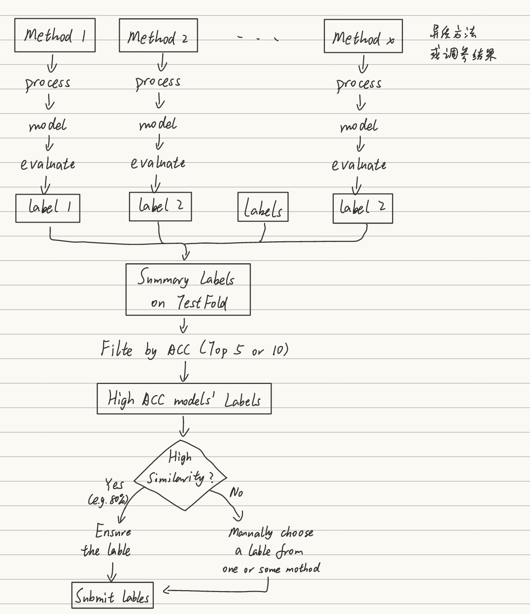

## 1_Overview_Labels



**文字转述**
```text
这张流程图展示了一个多方法模型结果融合与筛选的工作流程，常用于机器学习竞赛或模型集成任务中，目的是从多个模型 / 方法的预测结果中，筛选出最优的标签作为最终提交结果。下面我们一步步拆解它的逻辑：

1. 多方法并行生成结果
流程的起点是多个独立的方法 / 模型（Method 1 ~ Method x），它们各自完成完整的训练与预测流程：
process：数据处理与模型训练
model：训练得到的模型
evaluate：模型评估（得到验证集 / 测试集上的准确率）
label：每个方法最终生成的预测标签（label 1, label 2, ...）
右侧的 “异质方法 或 调参结果” 说明，这些方法可以是不同的算法 / 模型架构，也可以是同一模型不同调参得到的多个版本。

2. 汇总与初筛
汇总所有结果：把所有方法在测试集（Test Fold）上生成的标签，汇总成一份Summary Labels on Test Fold。
按准确率筛选：Filte by ACC (Top 5 or 10) —— 保留验证集 / 交叉验证中准确率最高的 Top 5 或 Top 10 个模型的标签，淘汰表现差的结果，减少后续计算量。

3. 相似度决策与最终提交
进入核心决策环节：
首先判断这些高准确率模型的标签之间，是否有很高的相似度（High Similarity?）：
Yes（相似度高，如 80% 以上一致）：说明多数模型的预测结果趋同，此时直接采纳这个一致性的标签即可，保证结果稳定。
No（相似度低，结果分歧大）：说明不同模型的预测差异明显，需要人工介入，从一个或几个表现好的方法中手动选择更合理的标签。
最终得到统一的Submit labels，作为最终的提交结果。

💡 这个流程的核心思想
这是一种典型的 **“模型集成 + 结果验证”** 策略：
用 “多方法 / 多调参” 保证结果的多样性，避免单一模型的偏差；
用 “准确率初筛” 淘汰弱模型，降低噪声；
用 “相似度判断” 自动处理高一致性的情况，仅在分歧大时才人工介入，平衡了效率与结果可靠性。
```

## 2_5-Fold cross validation


**文字转述**
```text
1. 背景：当前的数据划分方式
现有的划分将把带标签的数据分为训练集（Train）和验证集（Val），再单独留一个测试集（Test）。
这种单次划分的缺点是：结果会受随机划分的影响，无法稳定评估模型性能，也容易出现过拟合到验证集的情况。

2. 核心流程：5 折交叉验证的步骤
合并数据：把原来分开的训练集和验证集（都带标签）合并成一个完整的带标签数据集。
数据分折（Preprocess）：把合并后的数据集随机且均匀地分成 5 份（5 folds）。
每一份都轮流作为验证集（Val 1~5），剩下的 4 份作为训练集（Train 1~5）。
图中手写备注提到 “用预处理固定，避免多次划分随机波动”，就是为了保证划分的可复现性，减少随机性带来的误差。

模型训练与评估：
针对每一组（Train i, Val i），训练一个独立的模型（Model 1~5）。
分别在对应的验证集上评估每个模型，得到 5 组性能指标（如准确率 ACC、F1 分数等）。
结果汇总：
计算这 5 组指标的平均值，作为整个方法 / 模型的稳定性能评估结果。
同时也可以选出表现最好的那一折模型（Best Fold Model (s)），作为后续部署或进一步优化的候选。

3. 核心目的与优势
减少评估偏差：通过多次划分、多次训练和验证，避免单次数据划分的偶然性，让模型性能评估更稳定、更可靠。
数据利用更充分：所有带标签的数据都既参与了训练，也参与了验证，没有浪费数据。
防止过拟合：多次验证可以降低模型 “作弊式” 地拟合单一验证集的风险。
```

## 3_Method_Unsupervise pre-training & MoE

_Method_Unsupervise%20pre-training%20&%20MoE.jpg)

**文字转述**
```text
这个方案是一个「无监督预训练 + MoE 架构 + 下游微调」的两阶段学习流程，整体目标是提升模型在不同 EEG / 生理信号数据集上的泛化性能。

1. 模型整体架构

Input → Encoder Backbone → MoE（Mixture of Experts）→ Classifier (Dense) → Output

Encoder Backbone：特征提取的骨干网络
MoE：门控混合专家层，增强特征表达能力
Classifier Dense：全连接分类头，输出最终预测结果

2. 阶段一：无监督预训练（Unsupervised Pre-training）
多源数据混合：
收集多个公开数据集（BCIC2A、Chinese、MDD、Seed、Sleep），将所有数据（Train/Val/Test，无论是否带标签）混合，构建一个无标签的预训练数据集。
（注：我标注的是“数据永远实际存在，所以混入无标签的val+test集理论可行）
数据预处理：
对混合数据集做标准化 / 归一化，得到预处理后的标准化数据集。
SimSCL 对比学习预训练：
对标准化数据做数据增强，构造正样本对（同一数据的不同增强视图）和负样本对（不同数据的增强视图）。
冻结分类头（Classifier），仅训练 Encoder Backbone 和 MoE 层，通过对比学习损失优化特征提取能力，得到预训练模型。

3. 阶段二：特定数据集微调（Fine-tuning on Specific Dataset）
模型加载与初始化：
加载预训练好的 Encoder + MoE 权重，保留整体架构。
下游任务适配：
针对目标数据集，修改 / 重设分类头的输出维度，适配下游任务的类别数。
微调时采用 ** 梯度衰减（Gradient decay）** 策略，让分类头以更大学习率更新，Encoder/MoE 以更小学习率更新（图中标注了学习率比例 α:L）。

训练与验证：
仅在目标数据集的训练集上进行微调。
在验证集上评估模型性能，得到针对特定数据集的最终模型。
```