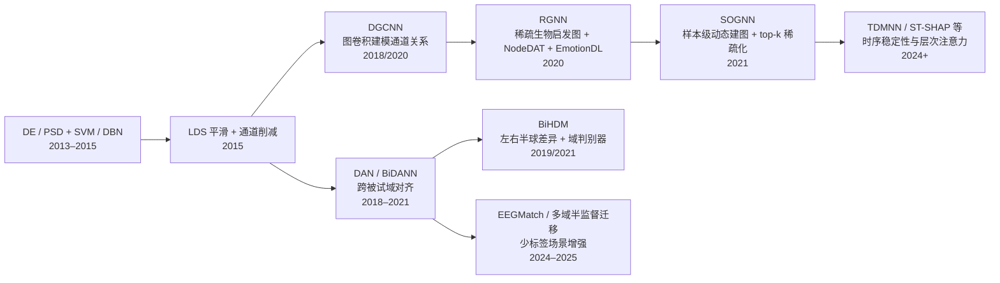

# SEED 情绪脑电论文深度分析报告

## 执行摘要

SEED 是上海交通大学发布的经典情绪脑电数据库。官方公开页给出的当前公开版本包含 15 名受试者、62 导 EEG、15 段情绪影片、约 3 次实验会话，并直接提供 5 个频带上的差分熵特征、DASM/RASM 特征以及经线性动态系统平滑后的特征；但最早的经典 DBN 论文使用的是“15 名受试者、两次实验、共 30 次实验”的版本。这意味着 **SEED 论文之间经常存在会话数、切分方式、是否跨被试、是否使用预提取 DE+LDS 特征的口径差异**，高分数不能直接横向比较。citeturn17view0turn17view3turn31view0

从高置信度证据看，**在 SEED 上最主流且最稳健的高性能路线是“DE 特征 + 图结构建模 + 跨被试对齐/正则化”**。图模型家族里，DGCNN 把 EEG 通道视为图节点并学习邻接；RGNN 在此基础上引入生物启发的稀疏图、NodeDAT 和 EmotionDL；SOGNN 则进一步做样本级动态建图，在 LOSO 跨被试设定上达到 86.81% ACC、0.8669 macro-F1。另一方面，**被试内或较宽松切分**下，BiHDM、ST-SHAP、TDMNN 这类更复杂的 RNN/注意力/多分支模型可以把 ACC 推到 93%–97%，但这些分数通常不应与 LOSO 跨被试结果直接对比。citeturn10view0turn8view3turn31view0turn36view0turn14search5turn12search2turn14search6

如果目标是“**跨被试、可复现、论文基线扎实**”，我建议优先从 **RGNN 或 SOGNN** 起步；如果目标是“**被试内追求极致分数**”，则可考虑 **BiHDM、ST-SHAP、TDMNN** 这类更重的模型，但必须明确报告切分方式、会话数与是否使用预提取特征。LibEER 的统一复现实验还表明，SEED 上很多原论文结果对预处理、切分与实现细节非常敏感，例如 RGNN 原报告 94.24%，统一库复现仅 84.66%；R2G-STNN 原报告 93.38%，统一库复现 84.11%。这说明 **SEED 上“评测口径”与“工程细节”本身就是结果的重要组成部分**。citeturn12search0turn31view0

## 数据集与评估口径

SEED 官方页面显示：公开数据包含 15 名中国受试者、62 通道 EEG；每段实验有 15 个 trial，对应正向、负向、中性三类情绪；预处理版本下采样到 200 Hz，并提供 5 个频带上的 DE 特征，以及 DASM、RASM 等不对称特征，并经过移动平均与 LDS 平滑。官方页面同时明确，公开版 `Preprocessed_EEG` 下共有 45 个 `.mat` 文件，即每位受试者约 3 次实验会话。citeturn17view0turn17view2

但经典基线论文《Investigating Critical Frequency Bands and Channels for EEG-Based Emotion Recognition with Deep Neural Networks》在摘要和实验部分都写明：该文使用的是 15 名受试者、每名受试者约两次实验、共 30 次实验，且训练集与测试集来自同一受试者的不同时间会话；这与当前公开版三会话 SEED 的口径并不完全一致。后续 RGNN 论文又指出，它在 SEED 上的 subject-dependent 评估沿用了“每个受试者前 9 个 trial 训练、后 6 个 trial 测试”的经典设定，而在 subject-independent 评估中使用 LOSO，并按一组会话求平均。**因此，SEED 文献里至少要区分四种常见设定：同被试跨会话、同被试固定 9/6 切分、跨被试 LOSO、以及仓库常见的 60/40 或 3:2 被试内切分。**citeturn17view3turn31view0turn12search2turn12search0

为满足本报告“按训练时间近似以参数量代理”的要求，下面采用一个**工程化分层口径**：小模型约小于 0.3M 参数；中模型约 0.3M–2M；大模型约大于 2M，或虽参数未明但存在显著顺序计算/多分支/多头注意力开销。凡论文未给参数量与训练耗时者，我都按公开结构图、默认实现或维度公式进行了**估算**，并明确标记为“估算”。可复现性则按“官方代码与否、预处理是否清楚、评测口径是否统一、是否有统一库复现”综合评为高/中/低。

## 模型线

**整体观察。** SEED 上最常见、最能稳定复现高性能的模型架构，大致可分成四个谱系：  
一是 **DE/PSD + 浅层分类器或 DBN** 的经典谱系；二是 **图神经网络谱系**，包括 DGCNN、RGNN、SOGNN；三是 **跨被试对抗/迁移谱系**，典型如 DAN、BiDANN；四是 **更重的时空混合架构**，如 BiHDM、TDMNN、ST-SHAP。就“高性能 + 社区采用度 + 工程可复用性”综合权衡，图模型谱系目前最占优势。citeturn16view0turn20view0turn28view0turn7view0turn32search0turn34view0turn14search5turn14search6

**小模型层级：DBN、DGCNN、RGNN。**  
**DBN** 是 SEED 的“祖师爷级”基线。原论文用 62×5=310 维 DE 特征输入两层 DBN，第一、第二隐藏层在 200–500 与 150–500 范围搜索；在两次实验跨会话的经典设定中，DBN 平均准确率 86.08%，高于 SVM 83.99%、LR 82.70%、KNN 72.60%。以 310 输入维和给定隐藏层搜索范围估算，其参数量大约在 **0.09M–0.41M**，训练复杂度并不高，但其优势更多来自 **DE 特征与跨会话稳定性**，而不是强大的端到端表征能力。优点是轻量、解释性强、可作为统一基线；缺点是无法显式利用通道拓扑，也不擅长处理跨被试分布偏移。原论文说明使用 DBNToolbox 的 Matlab 实现，但未发现作者单独发布的 SEED-DBN 专用仓库，因此可复现性评为 **中-低**。citeturn16view0turn18view0turn38view1

**DGCNN** 把每个 EEG 电极视作一个图节点，采用可学习邻接矩阵、ChebNet 图卷积和两层全连接分类头。TorchEEG 的公开实现给出的默认结构是：输入 62 个电极、每个电极 5 维频带特征，2 个图卷积阶数、32 隐藏通道，再接 `62×32→64→类别数` 的 MLP；按该实现估算，参数量约 **0.13M**，属于很轻量的图模型。性能方面，RGNN 论文在统一表中给出 DGCNN 在 SEED 上 **subject-dependent 为 90.40±8.49%，subject-independent LOSO 为 79.95±9.02%**。优点是参数小、训练快、比 DBN 更能利用通道关系；缺点是图结构虽然可学习，但仍偏“静态”，跨被试鲁棒性不如后续 RGNN/SOGNN。开源实现较多，TorchEEG 文档和多个 GitHub 复现仓库均可直接使用，可复现性评为 **高**。citeturn20view0turn22view0turn22view2turn31view0turn12search1

**RGNN** 是我认为当前 SEED 上最“稳、准、易复用”的小模型代表。原论文明确说它是在 SGC 的基础上扩展，使用 **生物启发的稀疏邻接矩阵 + 全局跨半球连接 + NodeDAT + EmotionDL**；作者还强调，相比注意力类 GNN，SGC 系在相近精度下训练速度更快。TorchEEG 给出的默认结构也是 62 电极、5 维频带输入、2 层图卷积、32 隐藏通道，并带可学习边权和 dropout；按公开实现估算，参数量约 **0.15M–0.25M**。性能方面，RGNN 在 SEED 上 **subject-dependent 为 94.24±5.95%，subject-independent LOSO 为 85.30±6.72%**，在跨被试场景明显优于 DGCNN。优点是跨被试性能强、官方代码完整、带清晰消融；缺点是其性能对预处理与评测口径很敏感，LibEER 统一复现下 SEED subject-dependent 只有 84.66%，与原文差距很大，需要严格对齐设置。官方 GitHub 仓库可用，可复现性评为 **高**，但“跨论文复现一致性”只能给 **中-高**。citeturn28view0turn30view0turn31view0turn24view0turn20view1turn12search0

**中模型层级：BiDANN、SOGNN。**  
**BiDANN/BiDANN-S** 的核心思想是把左右脑半球不对称性与域对抗训练结合起来。原摘要说明，它包含一个全局域判别器和两个局部域判别器，让左右半球分别学习更可分又更“域不敏感”的表征。由于它包含多路特征抽取与多个判别器，按架构估算参数量约 **0.3M–1.0M**，训练复杂度明显高于 RGNN 这类轻量图卷积。性能方面，RGNN 表中给出其在 SEED 上 **subject-dependent 为 92.38±7.04%**；SOGNN 表中给出 **BiDANN-S 在 LOSO 下为 84.14±6.87%**。优点是跨被试改进清楚，特别适合作为“加域对齐”的对照基线；缺点是训练更不稳定、实现细节较多，本次检索中没有确认到作者官方仓库，只能确认 LibEER 提供了 BiDANN 实现，所以可复现性评为 **中**。citeturn32search0turn31view0turn10view0turn12search0

**SOGNN** 是当前跨被试设置里很值得优先尝试的中模型。论文说明其结构由 **三个 conv-pool 块、三个自组织图层、三个图卷积层、一个全连接层和输出层** 组成；每个 SO-graph 层包含 64 个线性单元、32 个输出单元，并只保留 top-k 邻接权。作者明确指出，稠密图卷积计算代价高，因此使用 top-k 稀疏化来控制成本。按结构估算，参数量大约 **0.8M–2.5M**。性能上，它在 SEED LOSO 跨被试设定下达到 **86.81±5.79% ACC、0.8669 macro-F1、0.9685 AUC**，优于同表中的 BiHDM 85.40 和 RGNN 85.30。优点是样本级动态建图、跨被试表现强、官方代码已公开；缺点是训练慢于 RGNN/DGCNN，且模型对随机种子敏感，作者自己也报告 SEED 上平均准确率会在 0.83–0.88 间波动。可复现性评为 **高**。citeturn7view0turn8view0turn8view3turn10view0turn13search0

**大模型层级：BiHDM、TDMNN、ST-SHAP。**  
**BiHDM** 的设计重点不是“图”，而是“半球差异性”。原论文摘要和正文都显示，它先用 **四个定向 RNN** 从左右半球、水平/垂直两个方向遍历电极，再对对称电极做减法、除法、内积等成对操作，随后使用更高层 RNN 聚合差异特征，并用域判别器减小训练/测试间分布偏移。即使参数量未明确报告，我仍把它放在大模型层级，因为它包含多路 RNN 的顺序计算与对抗训练，实际训练时延显著高于小图模型。按结构估算，参数规模约 **1M–5M**。性能方面，BiHDM 在 SEED 上 **subject-dependent 为 93.12±6.06%，subject-independent LOSO 为 85.40±7.53%**。优点是对左右半球差异建模充分，跨被试和被试内都强；缺点是计算慢、结构复杂、官方代码本次未确认，仅找到非官方 PyTorch 实现，因此可复现性评为 **中-低**。citeturn34view0turn36view0turn11search3

**TDMNN** 是近年的时间建模代表。Springer 页面摘要显示，它利用“**情绪随时间缓慢变化**”这一先验，提出 temporal-difference minimizing neural network，并通过 time-check assessment module 与 multi-branch strategy 来利用时间稳定性；该页还写明 **SEED 上 ACC 达到 97.20%**。但当前可访问页面没有同时给出标准差、参数量、代码与明确的 SEED 实验切分，因此这些信息都必须标记为 **未说明/未确认**。从结构看，它属于典型的大时序模型，训练开销估计为 **高**。由于关键信息不完整，可复现性只能评为 **低到中**。citeturn14search2turn14search6turn9search22

**ST-SHAP** 代表了近年的层次注意力路线。原论文摘要页指出，它设计了一个 **同时建模全局与局部关系的层次化注意力网络**，并用 SHAP 来解释关键脑区；其官方代码仓库 README 列出了在 SEED 上 **60% 训练 / 40% 测试时 97.18±2.7% ACC** 的结果。由于仓库结果属于被试内固定切分，不是 LOSO 跨被试，所以不能与 SOGNN/RGNN 的跨被试数字混比。按“层次注意力 + 局部全局交互”的结构推断，它属于大模型，参数量估计约 **2M–8M**，训练开销也偏高。优点是准确率高且有解释性；缺点是当前最强结果依赖宽松切分，跨被试证据不足。官方代码可用，因此可复现性评为 **中**。citeturn14search5turn12search2

## 方法线

下面按“简单/复杂”两层梳理 **在 SEED 上真正经常带来收益的优化方法**。需要特别说明的是：许多论文只报告最终模型 ACC，不单独给出每个优化方法的净增益；此时我会明确标注“未单独报告”。

### 简单方法

| 方法 | 原理 | 代表论文 | 在 SEED 上的效果 | 训练/计算开销 | 实现要点与代码 |
|---|---|---|---|---|---|
| **DE 特征 + 全频带拼接 + LDS 平滑** | 用 5 个频带的 DE 描述每个通道，再用 LDS 平滑抑制无关波动、保留情绪随时间的连续性 | Zheng & Lu 2015；SEED 官方特征页 | 在经典 DBN 设定下，全频带 DE 达到 **86.08%**，优于同文中的 SVM 83.99%、LR 82.70%；作者还指出 Beta/Gamma 最有判别力。citeturn38view1turn38view3 | **低**；几乎所有后续模型都受益 | 官方站直接提供预提取 DE、DASM、RASM、LDS 特征，强烈建议先从这些特征起步，再上图模型。citeturn17view0turn17view2 |
| **通道选择 / 电极削减** | 利用 DBN 权重或先验选出“关键脑区”，减少输入维度、降低方差 | Zheng & Lu 2015 | 在该文 SVM 实验里，**12 通道配置可达 86.65%±8.62**，高于全 62 通道 **83.99%±9.72**；4 通道也能达到 82.88%。这说明 SEED 上“少而准的通道”是可行的。citeturn16view0turn38view1 | **低**；推理与训练都更快 | 适合做移动端或资源受限实验；但要固定通道列表并报告是否跨会话、跨被试。论文本身未提供单独仓库。citeturn16view0 |
| **不对称特征 DASM/RASM/DCAU** | 直接编码左右半球和前后脑区的不对称性 | Zheng & Lu 2015 | 论文指出这些不对称特征虽然维度远小于 PSD/DE，但能取得“可比精度”，证明半球差异本身是有效特征；不过**净增益未在可访问页面中单独量化**。citeturn38view1 | **低** | 适合轻量基线、也可作为 BiDANN/BiHDM 的先验输入。官方站已提供相关特征。citeturn17view0 |
| **传统 ML / 轻量深度模型做强基线** | 在线性 SVM、LR、DBN 之上先把特征做扎实，再上复杂模型 | Zheng & Lu 2015 | DBN 相比 SVM 提升 **约 2.09 个百分点**，且标准差更低。说明在 SEED 上，基础特征工程常常比盲目堆大模型更值钱。citeturn38view1 | **低** | 推荐把 DBN/SVM 作为所有新方法的 sanity check。citeturn16view0 |

### 复杂方法

| 方法 | 原理 | 代表论文 | 在 SEED 上的效果提升 | 训练/计算开销 | 实现要点与代码 |
|---|---|---|---|---|---|
| **域自适应 / 对抗训练** | 用域判别器或域对抗损失学习 subject-invariant 表征 | DAN；BiDANN；RGNN-NodeDAT | 在 SOGNN 汇总表中，**DAN 83.81 > DGCNN 79.95**，提升约 **+3.86**；**BiDANN-S 84.14 > DGCNN 79.95**，提升约 **+4.19**。RGNN 消融还显示，去掉 NodeDAT 后从 **85.30 降到 81.92**，损失 **3.38** 个点。citeturn10view0turn31view0turn29view4turn31view0 | **中到高**；需要稳定的对抗训练 | 如果目标是跨被试，几乎应把该类方法列为“默认候选”。BiDANN 目前可通过 LibEER 复现；RGNN 有官方代码。citeturn12search0turn24view0 |
| **图结构学习与稀疏化** | 从固定图转向可学习图、动态图，并用稀疏化控制成本 | DGCNN；RGNN；SOGNN | RGNN 消融表明：去掉全局连接，SEED LOSO 从 **85.30 降到 82.42**，损失 **2.88**；随机邻接初始化只到 **83.57**。SOGNN 还显示 top-k=10 的稀疏图与更稠密图性能相近，但计算更省。citeturn31view0turn8view0 | **中**；动态建图略更贵 | 对 SEED 而言，这是当前最有效的“主线优化”之一；RGNN/SOGNN 都有公开实现。citeturn24view0turn13search0 |
| **噪声标签正则 / 标签分布学习** | 用 label distribution 替代单硬标签，缓解影片诱发情绪与标注之间的不一致 | RGNN-EmotionDL | RGNN 消融显示，去掉 EmotionDL 后 SEED LOSO 从 **85.30 降到 82.27**，损失 **3.03** 个点；作者还在正文中明确说 EmotionDL 在两数据集上大约提升 3%。citeturn31view0turn29view5 | **中** | 这是一类经常被忽视但在 SEED 上很有效的正则；适合接到现有分类头之后。RGNN 仓库可作参考。citeturn24view0 |
| **半球差异显式建模** | 对左右对称电极做减法/比值/内积，显式学习脑半球差异 | BiHDM | 在 BiHDM 中，用“减法”替代简单拼接后，SEED subject-dependent 从 **90.52 提升到 93.12**，约 **+2.60**。citeturn35view4 | **高**；通常伴随多路 RNN/注意力 | 非常适合情绪 EEG，因为 SEED 上左右半球差异是稳定信号之一；但实现复杂、训练较慢。官方代码未确认，现有非官方复现可参考。citeturn34view0turn11search3 |
| **深生成数据增强** | 利用 cWGAN/sVAE/sWGAN 生成 realistic-like EEG 特征，缓解样本稀缺 | Luo et al. 2018/2020 | 摘要明确指出：这些增强方法在 SEED 和 DEAP 上**能提升情绪识别性能，并优于 cVAE、Gaussian noise、rotation augmentation**；但当前可访问摘要未给出统一的 SEED 净增益值，因此应标记为 **未单独报告**。citeturn39search2turn39search0turn39search1 | **中到高**；生成器训练额外耗时 | 如果数据量不足、标签不均衡或想做鲁棒性实验，这一类很值得加；但最好与固定基线配套做 ablation。citeturn39search2 |
| **半监督 + Mixup + 多域迁移** | 在标签不完整情形下，把 Mixup 生成样本、半监督、多域自适应联合起来 | EEGMatch | ResearchGate 摘要页写明：在 SEED、SEED-IV、SEED-V 的 LOSO 不完整标注场景下，EEGMatch 在 SEED 上相对 SOTA **提升 5.89%**，并给出代码位于 GitHub。citeturn39search5 | **高** | 如果你面临少标签/伪标签场景，这类方法比纯监督大模型更值；但实现链条较长，建议基于现成代码和统一评测框架做。citeturn39search5 |

从方法线归纳，SEED 上真正“经常有效”的不是孤立的某个 trick，而是三件事的组合：**好特征（DE/LDS）+ 好结构（图/半球时空）+ 好对齐（域自适应/噪声标签正则）**。其中，对跨被试最关键的两类优化是 **域对齐** 与 **图结构学习**；对轻量部署最关键的是 **通道选择**；对标签不足场景最有前景的是 **半监督迁移与生成增强**。citeturn38view1turn31view0turn8view0turn39search5turn39search2

## 综合比较与可视化

### 模型总表

> 说明：参数量与训练时间多为**估算**；“跨被试”指该行是否报告了 subject-independent / LOSO 结果；“公开代码”优先记官方仓库，其次为统一基准库或高质量复现；SEED 结果若同时存在被试内与跨被试，则一并列出。

| 模型 | 参数量估计 | 训练时间相对等级 | SEED 性能 | 是否跨被试 | 是否公开代码 | 可复现性评估 | 备注 |
|---|---:|---|---|---|---|---|---|
| **DBN** | 0.09M–0.41M（估算） | 低 | 86.08±8.34 ACC；经典两会话跨时段同被试设定 | 否 | 未发现作者专用仓库；论文说明基于 DBNToolbox | 中-低 | 经典起点，强在 DE+LDS，而非端到端结构。citeturn16view0turn18view0turn38view1 |
| **DGCNN** | ≈0.13M（按公开实现估算） | 低-中 | 90.40±8.49 ACC（被试内）；79.95±9.02 ACC（LOSO） | 是 | 有复现代码与 TorchEEG 支持 | 高 | 轻量图基线，适合算力受限与统一对照。citeturn20view0turn22view0turn22view2turn31view0turn12search1 |
| **RGNN** | 0.15M–0.25M（估算） | 中 | 94.24±5.95 ACC（被试内）；85.30±6.72 ACC（LOSO） | 是 | **官方代码已公开** | 高 | 跨被试最稳之一；但 LibEER 复现与原文差距较大。citeturn31view0turn24view0turn12search0 |
| **BiDANN / BiDANN-S** | 0.3M–1.0M（估算） | 中-高 | 92.38±7.04 ACC（被试内）；84.14±6.87 ACC（LOSO, BiDANN-S） | 是 | 未确认官方仓库；LibEER 含实现 | 中 | 半球不对称 + 域对抗，跨被试提升明确。citeturn32search0turn31view0turn10view0turn12search0 |
| **SOGNN** | 0.8M–2.5M（估算） | 中-高 | 86.81±5.79 ACC；macro-F1 0.8669；AUC 0.9685（LOSO） | 是 | **官方代码已公开** | 高 | 样本级动态建图；当前公开跨被试结果最强之一。citeturn10view0turn8view3turn13search0 |
| **BiHDM** | 1M–5M（估算） | 高 | 93.12±6.06 ACC（被试内）；85.40±7.53 ACC（LOSO） | 是 | 仅确认到非官方 PyTorch 复现 | 中-低 | 多路 RNN + 差异建模 + 域判别器，训练较重。citeturn34view0turn36view0turn11search3 |
| **TDMNN** | 2M–6M（估算） | 高 | 97.20 ACC；STD/切分方式未说明 | 未说明 | 未确认 | 低-中 | 时间稳定性建模有吸引力，但公开细节不足。citeturn14search2turn14search6turn9search22 |
| **ST-SHAP** | 2M–8M（估算） | 高 | 97.18±2.7 ACC（仓库 README：60% 训练 / 40% 测试） | 否/未说明 | **官方代码已公开** | 中 | 高分但口径更偏被试内；适合追求上限与解释性。citeturn14search5turn12search2 |

一个非常实用的现实结论是：**SEED 上“原论文分数”与“统一库复现分数”差异不小**。LibEER 给出的统一被试内 SEED 结果中，DGCNN 为 89.48（接近原始 90.40），DBN 为 81.18，BiDANN 为 89.06，RGNN 为 84.66，而 R2G-STNN 甚至从原报告 93.38 降到了 84.11。对研究者而言，这意味着在 SEED 上追求高性能时，**统一预处理、统一切分、固定随机种子、公开代码**的重要性不亚于模型本身。citeturn12search0

### 参数量与性能关系图

下图用“**估算参数量（横轴，近似对数刻度）**—**论文报告的 SEED ACC（纵轴）**”展示主要模型的位置。注意：图中混合了被试内、跨被试与未说明设定，因此**只能看趋势，不可作为严格排名**。跨被试最靠右上、同时证据最扎实的仍然是 **SOGNN / RGNN / BiHDM** 这一带；97%+ 的点主要来自 **TDMNN / ST-SHAP**，但评测口径更宽松或未说明。citeturn16view0turn31view0turn8view3turn36view0turn14search6turn12search2

<svg viewBox="0 0 640 380" width="100%" role="img" aria-label="SEED 参数量与性能散点图">
  <rect x="0" y="0" width="640" height="380" fill="white"/>
  <line x1="80" y1="320" x2="560" y2="320" stroke="black" stroke-width="1.5"/>
  <line x1="80" y1="320" x2="80" y2="40" stroke="black" stroke-width="1.5"/>
  <text x="300" y="360" font-size="14">参数量估计（对数尺度，单位约为 M）</text>
  <text x="18" y="180" transform="rotate(-90 18,180)" font-size="14">SEED 准确率 ACC（%）</text>

  <text x="72" y="335" font-size="12">0.1</text>
  <text x="200" y="335" font-size="12">0.3</text>
  <text x="320" y="335" font-size="12">1</text>
  <text x="445" y="335" font-size="12">3</text>
  <text x="548" y="335" font-size="12">10</text>

  <text x="50" y="325" font-size="12">78</text>
  <text x="50" y="255" font-size="12">83</text>
  <text x="50" y="185" font-size="12">88</text>
  <text x="50" y="115" font-size="12">93</text>
  <text x="50" y="45" font-size="12">98</text>

  <circle cx="162" cy="207" r="5" fill="white" stroke="black" stroke-width="1.5"/>
  <text x="170" y="202" font-size="12">DBN</text>

  <circle cx="107" cy="293" r="5" fill="white" stroke="black" stroke-width="1.5"/>
  <text x="116" y="289" font-size="12">DGCNN</text>

  <circle cx="141" cy="218" r="5" fill="white" stroke="black" stroke-width="1.5"/>
  <text x="150" y="214" font-size="12">RGNN</text>

  <rect x="262" y="229" width="10" height="10" fill="white" stroke="black" stroke-width="1.5"/>
  <text x="278" y="233" font-size="12">BiDANN</text>

  <rect x="334" y="192" width="10" height="10" fill="white" stroke="black" stroke-width="1.5"/>
  <text x="349" y="197" font-size="12">SOGNN</text>

  <rect x="429" y="211" width="10" height="10" fill="white" stroke="black" stroke-width="1.5"/>
  <text x="444" y="214" font-size="12">BiHDM</text>

  <polygon points="464,46 470,56 458,56" fill="white" stroke="black" stroke-width="1.5"/>
  <text x="475" y="54" font-size="12">TDMNN</text>

  <polygon points="488,46 494,56 482,56" fill="white" stroke="black" stroke-width="1.5"/>
  <text x="500" y="54" font-size="12">ST-SHAP</text>

  <text x="380" y="80" font-size="12">○ 轻/中型基线</text>
  <text x="380" y="100" font-size="12">□ 跨被试强模型</text>
  <text x="380" y="120" font-size="12">△ 高分但口径更宽松</text>
</svg>

### 方法演进图

SEED 方法演进可以概括为：**先把手工频带特征做对，再引入图结构，再解决跨被试偏移，再处理噪声标签与少标签问题，最后走向重型时序/注意力混合架构**。这条演进链与文献中的性能提升基本一致。citeturn16view0turn20view0turn28view0turn7view0turn39search2turn39search5

## 结论与实践建议

如果你的目标是**在 SEED 上做出“强而稳、论文可接受、跨被试有说服力”的结果**，我最推荐的配方不是直接追大模型，而是：  
先使用 **官方预提取 DE + LDS 特征**，把 **RGNN** 跑通作为首个强基线；然后再加上 **NodeDAT/EmotionDL** 或切到 **SOGNN**；如果你还要进一步追求跨被试上限，再比较 **BiHDM** 或半监督迁移方法。这个路线的好处是：每一步都能从文献中找到清楚的性能收益与可解释的机制，而且有代码可参考。citeturn17view0turn24view0turn31view0turn13search0turn36view0turn39search5

如果你的目标是**被试内最高分**，那么 ST-SHAP 与 TDMNN 这类更重的时间/注意力模型值得尝试；但你必须在论文中非常明确地写出：  
是否使用公开 DE 特征、切分是 9/6 还是 60/40、是否跨会话、是否跨被试、是否只用一个 session。否则 97% 的结果极易因为口径不一致而“看起来强、其实不可比”。SEED 文献最常见的坑，不是模型写错，而是**切分与预处理没有对齐**。citeturn12search2turn14search6turn17view3turn31view0turn12search0

如果你的约束是**算力少、想尽快做出能发表的 baseline**，则优先级大致如下：  
**DGCNN < RGNN < SOGNN < BiHDM / ST-SHAP / TDMNN**。前两者参数小、实现成熟；SOGNN 是高性能跨被试优先选项；BiHDM 适合强调脑半球机制；TDMNN/ST-SHAP 更像追“榜单上限”的工具。对于大多数研究者，**先把 RGNN/SOGNN 的 reproducible result 做扎实**，通常比一开始堆 Transformer 更划算。citeturn20view0turn24view0turn13search0turn34view0turn14search5turn14search6

本次调研中仍有几个限制需要明确：  
一是部分新模型页面只提供摘要，没有完整参数量与训练时间；二是部分高分模型未确认官方代码；三是 SEED 文献口径高度不统一，尤其是 2 会话/3 会话、subject-dependent/LOSO、60/40 固定切分之间差别很大。因此，**本报告最应被信任的结论不是“谁绝对第一”，而是“哪些架构与优化方法在什么评测口径下最有效”**。在这个问题上，答案已经相当清楚：**图结构学习 + 域对齐/标签正则，是 SEED 上最主流、最稳妥的高性能路径。** citeturn17view0turn17view3turn31view0turn8view3turn12search0

## 关键参考文献与代码

关键参考文献方面，最值得优先读的原始来源依次是：  
SEED 官方数据页与出版物页；Zheng & Lu 2015 的 DBN/DE 经典文；Song 等人的 DGCNN；Zhong 等人的 RGNN；Li 等人的 BiHDM；Li 等人的 SOGNN；以及近年的 TDMNN、ST-SHAP。它们基本覆盖了 **特征工程、图网络、对抗迁移、半球差异、动态建图、层次注意力** 这六条主线。citeturn3search1turn15search13turn16view0turn20view0turn28view0turn34view0turn7view0turn14search6turn14search5

代码与实现方面，本次检索中最有价值的链接来源是：  
**SEED 官方数据与特征页**；**RGNN 官方 GitHub**；**SOGNN 官方 GitHub**；**DGCNN 的 TorchEEG 与高质量复现仓库**；**ST-SHAP 官方仓库**；以及 **LibEER** 这一统一 benchmark/算法库。对于想做严谨实验的研究者，我更推荐“**先用 LibEER 或 TorchEEG 跑通统一口径，再替换成自己的模型**”，这样最能避免 SEED 上常见的复现偏差。citeturn17view0turn24view0turn13search0turn20view0turn12search1turn12search2turn12search0